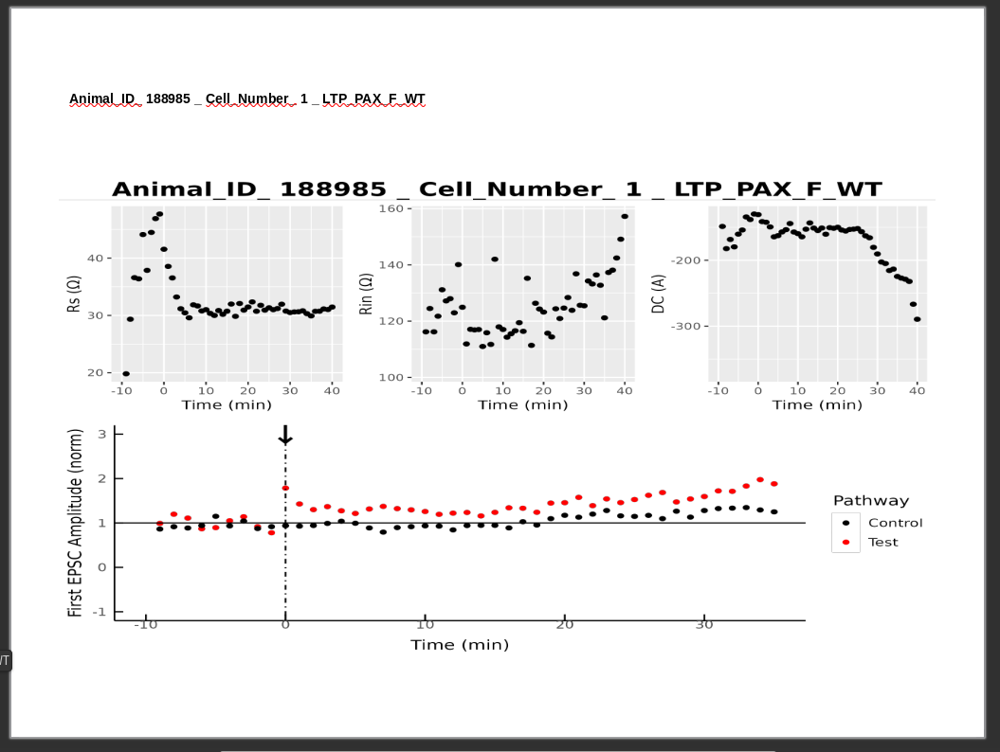
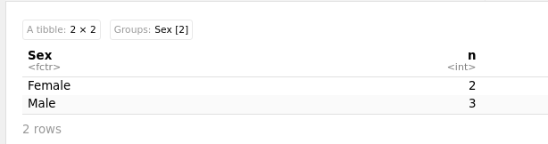
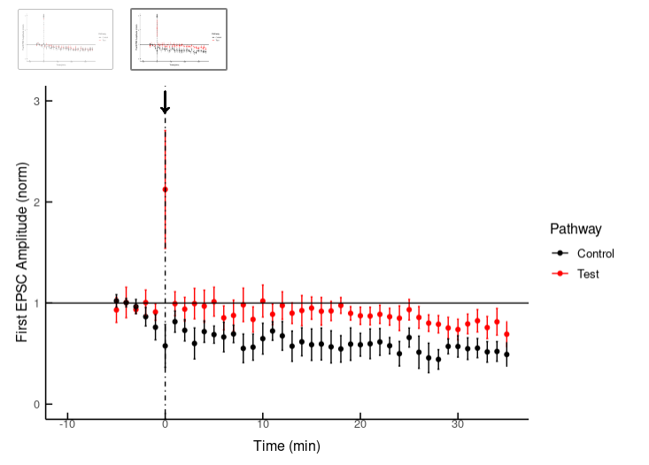
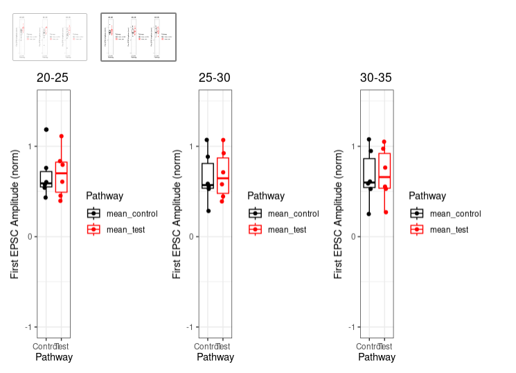
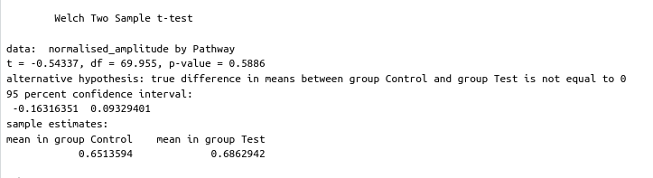

# LTP analysis library

A library to analyse LTP that has been saved in longformat.

## Features

- **Pre-processing and cleaning**: removal of any NA values, checking for outliers and unique cell identification.

- **Ability to save to wide format**: A strangely difficult system to put in place to convert this kind of data back to a wide format is included. There might be an easier way to do this but for now I have hacked something together to make this work.

- **Individual cell analysis**: use of resistance measurements to generate a powerpoint slide deck with one slide per cell for rapid analysis.

- **Publishable quality figure generation**: Combined timecourse figures and 5 minute bin.

## Repository Structure

    - `R/`: Individual scripts for the library.
    - `man/`: Manual pages

## Usage

Install and load the package as follows:

```R
# Install package
if (!requireNamespace("remotes", quietly = TRUE)) {
install.packages("remotes")
}
remotes::install_github("richardsonp2/ltp_analysis", force = TRUE)

# Load the ltp_analysis package
library(ltppackage)
# Load officeR package for powerpoint generation below
library(officeR)
```

Load the long format data.

```R
example_data <- read_csv_function("./example_dir/longformat_data.csv")
```

Find only unique cells and have a UID for that cell. Eg 203666_1

```R
unique_cells <- find_unique_cells(example_data) 
unique_cells_vector <- as.vector(unique_cells)
```

Generate the powerpoint slides with individual slides per cell

```R
ppt <- read_pptx()

#WT
# WT dataset
ppt <- Reduce(function(ppt, cell_id) {
print_try_function(ppt, cell_id, example_data)
}, unique_cells_vector, ppt)
print(ppt, target = "./powerpoints/example_individual_cells_presentation.pptx")
```

Example:\


After going through the cells you can select which cells you will include in the analysis

```R
example_filtered_cells <- c("123456_1", "123456_2", "654321_1", "404666_1") 
```

Preprocess the dataset (Giving standardised names, converting columns to factors/ints)

```R
example_df <- pre_process_datasets(example_data)
```

Filter the cells you want

```R
filtered_df <- example_df %>% 
filter(animal_cell_id %in% example_filtered_cells)
```

Show the counts

```R
sex_count <- filtered_df %>% 
distinct(animal_cell_id, .keep_all = TRUE) %>%
group_by(Sex) %>% 
count()
sex_count
```

Example:\


This is the combined longitudinal plot

```R
combined_plot_example <- main_combined_run(filtered_df)
combined_plot_example
```

Example:\


Show box and whisker plots for individual bins of 5 minutes.

```R
plot_20_25_example <- generate_full_bin_figure_function(filtered_df, bin_start = 20)
plot_25_30_example <- generate_full_bin_figure_function(filtered_df, bin_start = 25)
plot_30_35_example <- generate_full_bin_figure_function(filtered_df, bin_start = 30)

combined_bin_plots_example <- ggarrange(plot_20_25_example,plot_20_25_example, plot_30_35_example, ncol = 3, nrow = 1)

combined_bin_plots_example
```

Example:\


You can show the longitudinal plot alongside a bin plot.

```R
longitudinal_and_binplot_example <- longitudinal_and_binplot(combined_plot_example, plot_30_35_example)
longitudinal_and_binplot_example
```

You can run simple statistical analysis on a bin of your chosing

```R
five_bin <- filter_five_bin(filtered_df, bin_start = 25)

#Convert to long format
bin_longer <- five_bin %>%
pivot_longer(cols = c("Test", "Control"), names_to = "Pathway", values_to = "normalised_amplitude")

example_ttest <- apply_test_control_model(bin_longer)
example_ttest
```

Example:\

